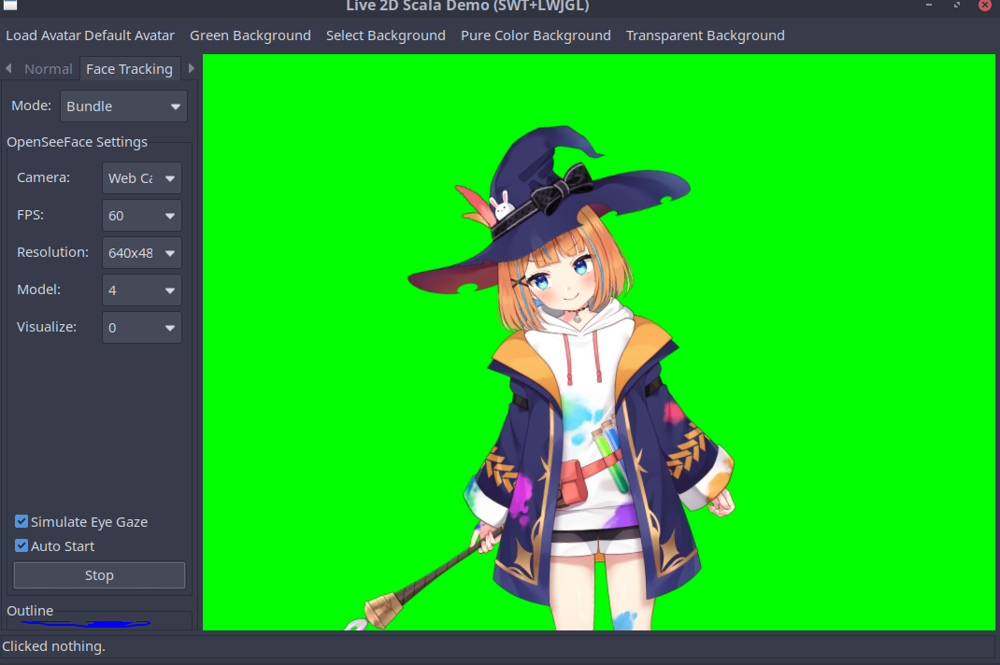

## Live2D For Scala (Forked Project)


**Live2D For Scala** is a cross-platform real-time facial tracking and rendering framework for Live2D models, built with Scala and running on the Java Virtual Machine (JVM). It supports Linux, Windows, and Intel-based macOS systems.  
This project is a **fork of the original [brianhsu/Live2DForScala](https://github.com/brianhsu/Live2DForScala)**, aiming to expand its functionality and improve the user experience while maintaining its clean and modular architecture.

I would like to express sincere gratitude to the original author of [brianhsu/Live2DForScala](https://github.com/brianhsu/Live2DForScala) and the developers of related upstream projects such as [facial-landmarks-for-cubism ](https://github.com/adrianiainlam/facial-landmarks-for-cubism)and [OpenSeeFace ](https://github.com/emilianavt/OpenSeeFace). Their work laid the foundation for this project and continues to inspire further development and improvements.

## Functionality Overview of the Original Project

- Built upon the official Live2D Cubism Core SDK, with full support for animation, physics, expressions, lip sync, etc.
- Real-time facial tracking using OpenSeeFace to drive Live2D avatars
- Cross-platform support: Linux, Windows, macOS (Intel only)
- Designed with Clean Architecture for high modularity and extensibility
- Supports both Swing + JOGL and SWT + LWJGL rendering pipelines

## Functionality Overview of This Project

- Body Movement and Full-Body Sway Driven by Face Tracking
- Transparent Background Rendering for OBS Capture

  ✅Works on Windows and Wayland.
  
  ❌ Not supported on X11 due to limitations in transparency handling.
- Expression Shortcut Keys (1–9)
- Simulate Eye Gaze
- Enabling the Auto Start, Simulate Eye Gaze and Disable Eye Blink checkbox in the face tracking panel writes a auto_start file so tracking starts with those options applied on next launch
- Default Avatar
- XWayland support

###  Screenshots



Simulate Eye Gaze

<video src="https://github.com/user-attachments/assets/0218a09a-a412-48b9-885e-a35aeba2a373" 
width="320" controls></video>

## Getting Started for Developers and Users

To get started with this project, please refer to the following guides:

[Old_README.md](Old_README.md): Original reference documentation from the upstream project. Useful for historical context and compatibility.

[Using_Guideline.md](Using_Guideline.md):
A step-by-step user guide covering model loading, webcam tracking, expression shortcuts, and OBS integration.

[Developing_Guideline.md](Developing_Guideline.md): Instructions for building, compiling, testing, and contributing to the project.

## To do list
  - [ ] Control OpenSeeFace -> Live2D model motion parameter through UI.
  - [ ] Migrating from SWT and Swing to the JavaFX Framework


## License
This project is released under the **MIT License**, which applies to all original code and demonstration applications included in this repository.

However, please note that the project includes third-party components and dependencies that are subject to their own respective licenses. By using this software, you acknowledge and agree to comply with all applicable licenses listed below.

---

###  Main License

- **MIT License**  
  Applies to: This forked project's original code, modifications, and demo applications  
  > © 2025 [jjiill888}]  
  > This project is a fork of [brianhsu/Live2DForScala](https://github.com/brianhsu/Live2DForScala) and continues to use the MIT License.  
  > See [`LICENSE`](LICENSE) for full license text.

---

###  Third-Party Licenses

####  Live2D Cubism Core (Proprietary License)

This project includes the native Live2D Cubism Core libraries required at runtime. These are subject to the [Live2D Proprietary Software License Agreement](https://www.live2d.com/eula/live2d-proprietary-software-license-agreement_en.html).

Files:
```
modules/core/src/main/resources/linux-x86-64/libLive2DCubismCore.so
modules/core/src/main/resources/win32-x86-64/Live2DCubismCore.dll
modules/core/src/main/resources/darwin/libLive2DCubismCore.dylib
```

> ⚠ You must accept the official Live2D license terms in order to use these binaries.

---

####  Live2D Model Assets (Free Material License)

Sample models used in testing are provided under the [Live2D Free Material License](https://www.live2d.com/eula/live2d-free-material-license-agreement_en.html) and are intended for non-commercial, educational, or testing purposes only.

---

####  [facial-landmarks-for-cubism](https://github.com/adrianiainlam/facial-landmarks-for-cubism)

- License: **MIT**
- Contribution: Provides the algorithm for mapping OpenSeeFace data to Live2D parameters.

---

####  [OpenSeeFace](https://github.com/emilianavt/OpenSeeFace)

- License: **BSD-2-Clause**
- Contribution: Provides the real-time facial tracking engine bundled with this project.

Includes dependencies such as:

| Library     | License       |
|-------------|---------------|
| OpenCV      | Apache 2.0    |
| ONNX Runtime| MIT           |
| Pillow      | HPND          |
| NumPy       | BSD           |

---

####  UI Icons (Flaticon)

Icons used in the application interface are licensed via [Flaticon License](https://www.freepikcompany.com/legal#nav-flaticon):

- Power: [Gregor Cresnar - Flaticon](https://www.flaticon.com/free-icons/power)
- Settings: [Gregor Cresnar - Flaticon](https://www.flaticon.com/free-icons/settings)
- Speaker: [Freepik - Flaticon](https://www.flaticon.com/free-icons/speaker)